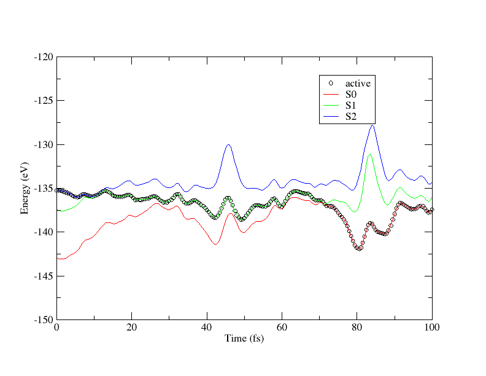
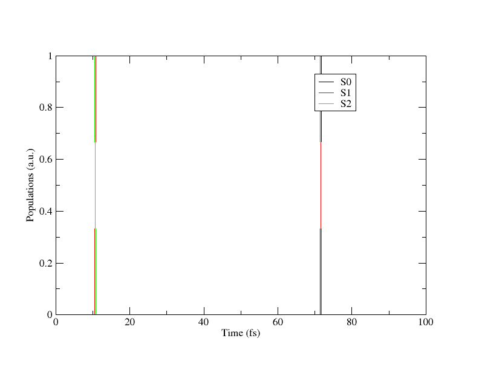
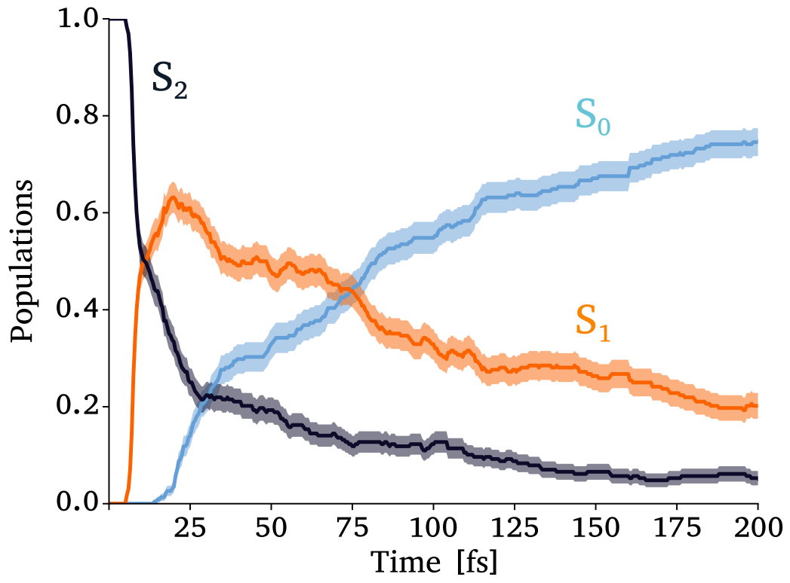

.. highlight:: none

.. |S0| replace:: S\ :sub:`0`
.. |S1| replace:: S\ :sub:`1`
.. |S2| replace:: S\ :sub:`2`

**************************
Analysis of TSH simulation
**************************

In this section, we will analyze the trajectories generated in the
previous step. SHARC provides several scripts to automate this 
process. However, in this tutorial we will focus on a few simple
but important analyses that help understand the photodynamics of 
the system under investigation.

Inside each trajectory folder, execute the following command to 
extract the relevant information::

   $SHARC/data_extractor.x output.dat

This will generate the ``ouput_data`` folder, where several files
containing different types of information are stored. We can begin
the analysis using the data available in this directory.

The following command will plot the evolution of the potential energy surfaces
along the trajectory::

   xmgrace -block energy.out -bxy 1:3 -bxy 1:5 -bxy 1:6 -bxy 1:7 -pexec "s0 line type 0" -pexec "s0 symbol 1" -pexec "s0 symbol size 0.5" -pexec 's0 legend "active"' -pexec 's1 legend "S0"' -pexec 's2 legend "S1"' -pexec 's3 legend "S2"' -pexec 'xaxis label "Time (fs)"' -pexec 'yaxis label "Energy (eV)"'

.. _potential_evolution:

   Potential Energy Surfaces evoulution

In figure :numref:`potential_evolution` `active` represents the
potential energy surface on which the system is evolving at a given
time. It is highly recommended to analyze this figure together with
the molecular trajectory. By doing so, it is possible to identify
the main nuclear motions involved in the non-adiabatic transitions
|S2| -> |S1| and |S1| -> |S0|

Another useful analysis is the evolution of the electronic state 
populations over time. This can be obtained with the following
command::

   xmgrace -block coeff_class_MCH.out -bxy 1:3 -bxy 1:4 -bxy 1:5 -pexec 's0 legend "S0"' -pexec 's1 legend "S1"' -pexec 's2 legend "S2"' -pexec 'xaxis label "Time (fs)"' -pexec 'yaxis label "Populations (a.u.)"'

.. _population:

   Electronic Populations

The data presented in Figure :numref:`population` should not be
used to draw general conclusions about the photodynamics of the 
system, since it corresponds to a single trajectory. However, by
averaging the populations over all trajectories, it is possible to
obtain statistically meaningful results:

.. _population-average:

   Average Electronic Populations using 200 trajectories
   (Extracted from ref `TSH-DFTB+ <https://pubs.acs.org/doi/full/10.1021/acs.jctc.4c01263>`_)

The analyses presented here represent only a subset of the information 
available from TSH simulations (see `TSH-DFTB+ <https://pubs.acs.org/doi/full/10.1021/acs.jctc.4c01263>`_). Depending on the system 
and the processes of interest, many other analyses can be performed, 
such as identifying relaxation pathways, key nuclear motions, 
excited-state lifetimes, branching ratios, or structural changes.
The choice of analysis ultimately depends on the specific scientific
questions being addressed.

